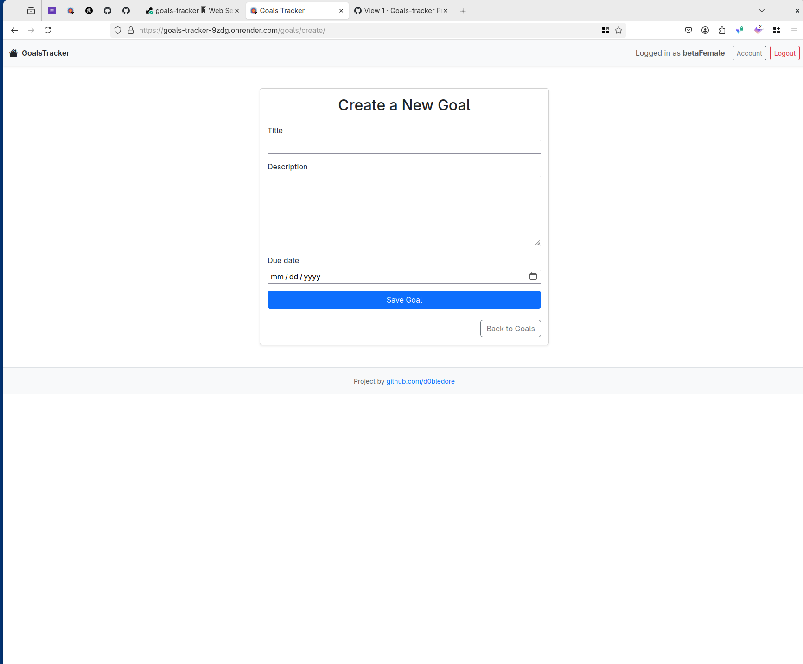
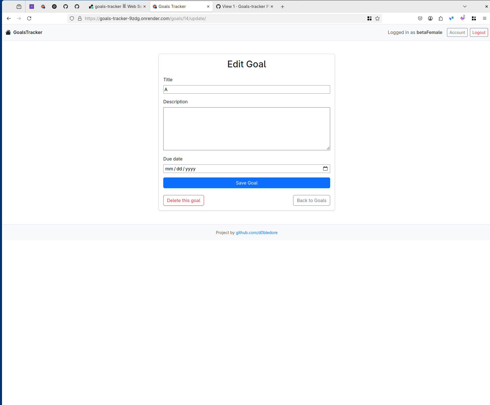
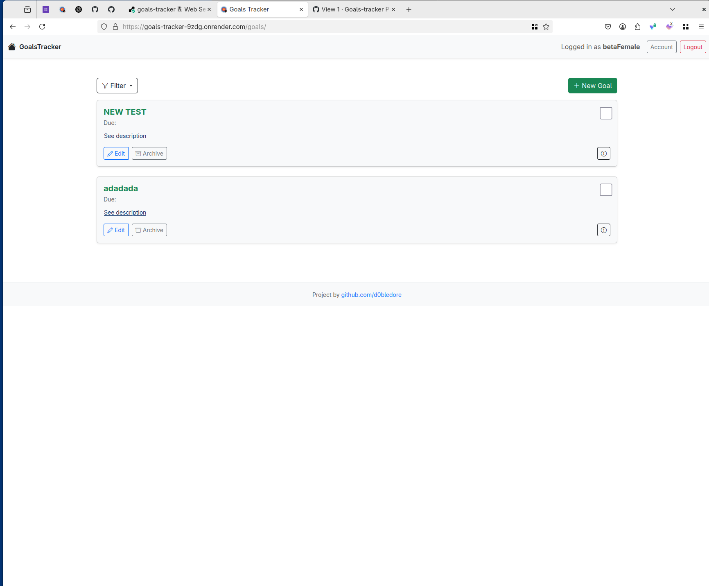
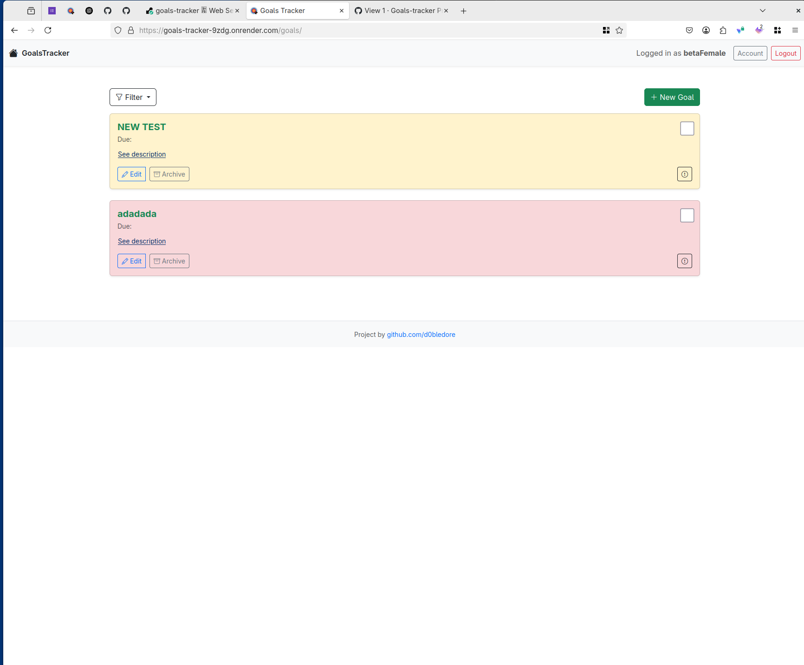
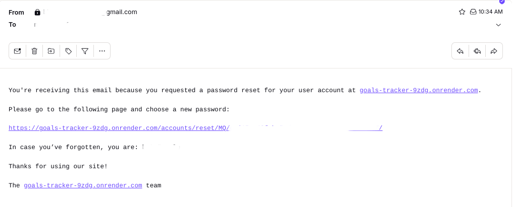

# [GoalsTracker](https://goals-tracker-9zdg.onrender.com/)

## Introduction

GoalsTracker is a goal-setting web application built with Django. It provides users with a minimal and focused interface to define, manage, and complete their personal goals. Unlike full-featured productivity apps, GoalsTracker embraces simplicity — prioritizing essential functionality with a clean Bootstrap-based design and intuitive flow.

---

## UX Design

This application follows a clean and minimal UX approach:

- **Interface**: Bootstrap is used for layout and responsiveness.
- **Typography**: Default Bootstrap typography ensures consistency and simplicity.
- **Focus**: UX is intentionally kept minimal to draw user attention toward completing tasks rather than navigating features.

---

## User Stories

- As a user, I want to sign up and log in, so that I can manage my own goals.
- As a user, I want to create, edit, and delete goals, so that I can track my progress.
- As a user, I want to mark a goal as completed, so that I can feel progress and stay motivated.
- As a user, I want to set a due date or deadline for each goal, so that I stay accountable.
- As a user I want to be able to reset my password in case I forget it.
- As a user I want to be able to set priority for my goals, so I can prioritize better.
---

## Features

### Existing Features

- User authentication: Sign up, log in, and log out

- Goal creation (C in CRUD)
- Goal viewing and list display (R in CRUD)
- Goal update/edit (U in CRUD)
- Goal deletion (D in CRUD)
- Completed goals appear with strike-through styling
- Only authenticated users can view, create, or edit their own goals
- Password Reset via Email

📷 **Image sections for each CRUD action**  

- Create a new Goal

- Edit Goal

- Read Goal List

- Set priority

**Password Reset Email**

---

### Future Features

- **Email Reminders**: Users will be able to receive email reminders for upcoming or overdue goals. These will be customizable via their account settings.
- **Goal Sharing**: Users will be able to share a goal with other registered users, encouraging collaboration or accountability.
- **Daily Quotes**: A rotating display of motivational quotes will be added to inspire users and boost morale.

---

## Tools & Technologies Used

-  used for version control (`git add`, `git commit`, `git push`)
-  used for secure online code storage
-  used as the local IDE for development
-  used for building static page content
-  used for styling the application
-  used for interactive checkbox functionality
-  used for server-side programming
-  used as the CSS framework for layout and design
-  used as the main web framework
-  used as the project database
-  used for serving static files with Render
-  used to host the live site
- Gmail SMTP was used for sending emails
- Gunicorn was used as the production-level WSGI server for deployment

---

## Agile Development Process

### GitHub Projects

[GitHub Projects](https://github.com/users/D0bledore/projects/6) was used as an Agile planning board. 

This workflow helped maintain continuous, incremental development and focused feature delivery.

---

## Testing

> [!NOTE]  
> For all testing, please refer to the [TESTING.md](TESTING.md) file.

---

## Deployment

The live deployed application can be found at:  
👉 [https://goals-tracker-9zdg.onrender.com/](https://goals-tracker-9zdg.onrender.com/)

---

## Credits

### Content

- [Django CBV Docs – DeleteView](https://docs.djangoproject.com/en/stable/ref/class-based-views/generic-editing/#django.views.generic.edit.DeleteView)
- [Django Messages Framework](https://docs.djangoproject.com/en/stable/ref/contrib/messages/)

### Media

No external media used.

### Acknowledgements

I am deeply thankful to the [Code Institute](https://codeinstitute.net) for providing me with this incredible opportunity to advance my career. The skills and knowledge I have gained through this program have been transformative.

I want to extend my deepest appreciation to my partner, **Rose**, for her unwavering belief in me. Her encouragement led me to discover the Code Institute and apply for the Full-Stack Software Development Course, which has been a pivotal step in my professional journey.
