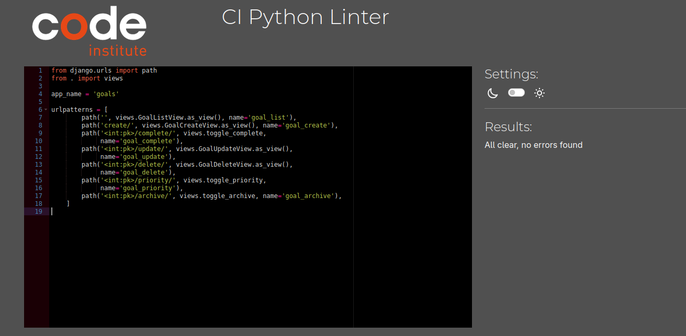
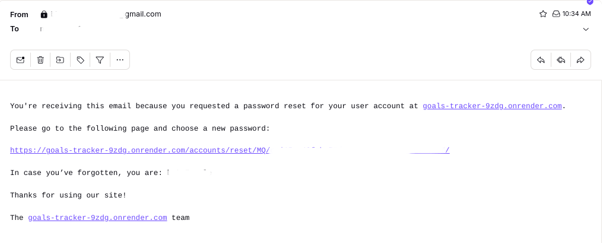

# Testing – GoalsTracker

This document outlines the test strategy and results for the GoalsTracker web application.

---

## Code Validation

### HTML

All HTML files have been validated using the [HTML W3C Validator](https://validator.w3.org).
All files were tested on the LIVE site.

| Directory | File | Screenshot | Notes |
| --- | --- | --- | --- |
| core | homepage.html |  | No errors |
| accounts | login.html |  | No errors |
| accounts | signup.html |  | No errors |
| accounts | profile.html |  | No errors |
| accounts | password_change.html |  | No errors |
| accounts | password_change_done.html |  | No errors |
| accounts | password_reset.html |  | No errors |
| accounts | password_reset_confirm.html |  | No errors |
| accounts | password_reset_done.html |  | No errors |
| accounts | password_reset_complete.html |  | No errors |
| goals | goal_confirm_delete.html |  | No errors |
| goals | goal_form.html |  | No errors |
| goals | goal_list.html |  | No errors |

### CSS

Validated using [Jigsaw CSS Validator](https://jigsaw.w3.org/css-validator)

| File | Screenshot | Result |
|------|--------|------|
| styles.css |  ✅ No errors | 

### JavaScript

All JavaScript files have been validated using the [JShint Validator](https://jshint.com).

> [!NOTE]  
> Configure JSHint using the comment: `/* jshint esversion: 11 */`

| Directory | File | Screenshot | Notes |
| --- | --- | --- | --- |
| static | goals.js |  | No errors |

---

All relevant Python files have been validated using the [PEP8 CI Python Linter](https://pep8ci.herokuapp.com).

| Directory | File | Screenshot | Notes |
| --- | --- | --- | --- | 
| accounts | forms.py  |  | All clear |
| accounts | urls.py  |  | All clear |
| accounts | views.py  |  | All clear |
| goals | forms.py  |  | All clear |
| goals | models.py  |  | All clear |
| goals | urls.py |  | All clear |
| goals | views.py  |  | All clear |
| goals/tests | test_models.py |  |
| goals/tests | test_security.py |  |
| goals/tests | test_views.py |  |
| core | views.py  |  | All clear |
| goalstracker | settings.py  |  | All clear |
| goalstracker | urls.py |  | All clear |


## Manual Functional Testing

| Feature | Test | Expected Result | Actual Result |
|--------|------|------------------|----------------|
| Sign up | Register with valid email & password | Account created | ✅ Pass |
| Login | Enter valid credentials | Redirect to goal list | ✅ Pass |
| Create Goal | Fill in title & date | Goal appears in list | ✅ Pass |
| Edit Goal | Modify text & date | Goal updates in list | ✅ Pass |
| Mark Complete | Click checkbox | Goal line-through applied | ✅ Pass | ✅ Pass |
| Archive Goal | Click archive | Goal is placed under Archived Goals | ✅ Pass |
| Unarchive Goal | Click restore | Goal is placed back in list |  ✅ Pass |
| Toggle priority | Click ! - mark | Goal changes color |  ✅ Pass |
| Filter for priority | Click Filter, test all priority filters | Filters only goals for selected priority |  ✅ Pass |
| Delete Goal | Click delete | Goal removed + success msg | ✅ Pass |
| Test 404 page | Type random string in url | 404 page appears |  ✅ Pass |
| Test Email Password Reset | Click 'Forgot password?' & enter valid email | Receive email with password reset link |   ✅ Pass |
---

## Browser Compatibility

The deployed project has been tested on multiple browsers to ensure compatibility.

| Browser | Homepage | Goals | Profile | Notes |
| --- | --- | --- | --- | --- | 
| Chrome |  |  |  | Works as expected |
| Firefox |  |  |  | Works as expected |
| Opera |  |  |  | Works as expected |


## Responsiveness

The deployed project has been tested on multiple devices to ensure responsiveness.

| Device | Homepage | Goals | Profile | Notes |
| --- | --- | --- | --- | --- |
| Mobile (DevTools) |  |  |  | Works as expected |
| Tablet (DevTools) |  |  |  | Works as expected |
| Desktop |  |  |  | Works as expected |


## Lighthouse Audit

The deployed project has been tested using the Lighthouse Audit tool to identify any major issues.

| Page | Mobile | Desktop | Notes |
| --- | --- | --- | --- |
| Home |  |  | Good results |
| Profile |  |  | Good results |
| Goals |  |  | Good results |

---

## Defensive Programing
Defensive programming techniques have been implemented throughout the application to ensure robustness, clarity, and user safety—especially in critical user flows such as authentication and form handling.

Login & Signup Validation

    Form validation ensures that users cannot submit empty fields, weak passwords, or invalid emails.

    Custom error messages provide clear feedback (e.g., "Passwords do not match" or "This username is already taken") to guide the user toward correcting their input.

    Server-side checks prevent bypassing the frontend constraints, ensuring security even if a malicious user attempts to manipulate form submissions.

Error Messaging & Feedback

    All forms include proper handling of both field-specific errors and non-field errors (e.g., login failure due to incorrect credentials).

    Forms are rendered again with user input preserved and errors highlighted clearly using Bootstrap styling for better UX.

Authorization Controls

    Users are not allowed to view, edit, or delete other users’ goals.

    Attempts to do so will result in a 404 error, even if the URL is guessed or manually entered.

    This ensures that data remains private and tamper-proof.

Form Resilience

    All form submissions are protected using CSRF tokens.

    Django’s built-in validation and additional widget-level styling enforce consistent and safe input handling.


## Automatic Tests

This project includes a test suite to ensure that the goal tracking functionality is working as intended. The tests cover core aspects of goal creation, access control, and view behavior for different users.

To run all tests for this Django project, use:

```bash
python manage.py test
```

1. test_models.py

Tests for validating the behavior of the Goal model.

    - test_goal_creation: Ensures that a Goal object is created correctly and fields are saved as expected.

    - test_goal_str_representation: Confirms that the __str__ method returns the goal’s title.

    - test_goal_default_completed_false: Checks that new goals are marked as not completed by default.

2. test_security.py

Tests for enforcing user access restrictions.

    - test_unauthenticated_cannot_access_goal_views: Makes sure unauthenticated users are redirected when trying to access any goal view.

    - test_404_on_nonexistent_goal: Confirms that accessing a non-existent goal returns a 404 error.

    - test_user_cannot_access_other_users_goal_directly: Ensures one user cannot access another user's goal via direct URL.

    - test_cannot_create_goal_with_invalid_data: Prevents goal creation with invalid or incomplete data.


3. test_views.py

Tests focused on user interactions with views.

    - test_login_required_for_goal_list: Verifies login is required to view the goal list.

    - test_user_can_see_own_goals: Confirms users only see their own goals.

    - test_user_cannot_see_others_goals: Ensures a user cannot view goals that belong to others.

    - test_create_goal: Validates that a logged-in user can create new goals.

    - test_update_own_goal: Ensures users can update their own goals.

    - test_user_cannot_edit_others_goal: Prevents users from editing other users’ goals.

    - test_delete_own_goal: Allows a user to delete their own goal.

    - test_user_cannot_delete_others_goal: Blocks a user from deleting someone else’s goal.

## Bug: Success Message Not Displaying After Goal Deletion


### Context

While implementing the `GoalDeleteView` in Django using `django.views.generic.DeleteView`, I wanted to display a success message to the user after confirming the deletion of a goal.


The `DeleteView` was working correctly — the goal was being deleted and redirected to the goal list — but the message:


```python


messages.success(request, "Goal deleted!")


``` 

never appeared. 


### Diagnosis 


My first approach was to override the delete() method in GoalDeleteView like this:


```python


def delete(self, request, *args, **kwargs):


    messages.success(self.request, "Goal deleted!")


    return super().delete(request, *args, **kwargs)


```

However, Django never called this method. No message appeared, and even inserting a debug `print()` revealed that the method wasn't triggered. Yet, the goal still deleted properly — clearly, Django was falling back to the default behavior.

This strongly suggested that my delete() override was either:


- Incorrectly defined (e.g., missing arguments)
- Not being recognized due to some deeper internal handling

### Solution

Instead of overriding `delete()`, I took a cleaner, more reliable approach by overriding `get_success_url()` — a method Django does call after a successful deletion.

```python

def get_success_url(self):


    messages.success(self.request, "Goal deleted!")


    return reverse_lazy('goals:goal_list')


```

This method runs after the object is deleted and before the user is redirected. Perfect spot to inject feedback like messages.

### Takeaways

- django.views.generic.DeleteView handles deletion via a built-in post() → `delete()` pipeline.

- Overriding `delete()` is possible, but the signature must be exact — and mistakes lead to silent failures.

- `get_success_url()` is a safe, clean alternative for post-action hooks like setting success messages.

### Reflection

This bug took over an hour to identify and resolve. It deepened my understanding of Django’s class-based views and reinforced the principle of relying on the framework’s intended extension points (like `get_success_url()` over `delete()` for non-critical logic).


## Unfixed Bugs

There are no unfixed bugs left that I am aware of. 


## Summary

All core features have passed manual and automated testing.  
Edge cases and unauthorized access are handled.  
Future features will require new test coverage upon implementation.
T
